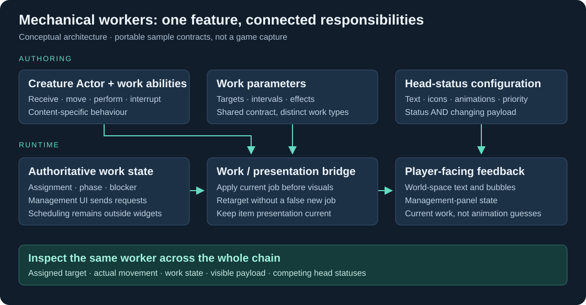

# Mechanical Workers — Gameplay, World-space UI & Authoring

**Making autonomous production readable, configurable and reliable.**

A gameplay/UI engineering case study by **Evan Ge**. Mechanical creatures can be assigned to gather, transport, craft and maintain a player's base. Their work is automatic; the interface must explain what they are doing, what is blocking them, and what the player can change.

[中文](README.zh-CN.md) · [Case studies](docs/CASE_STUDIES.md) · [Authoring journey](docs/AUTHORING.md) · [Architecture & code tour](docs/ARCHITECTURE.md) · [Visuals](media/README.md) · [Run & test](docs/TESTING.md)

## My work in context

I developed and maintained the integration between production jobs and creature behaviour: receiving work, transitioning between movement and performance, handling changing targets and interruptions, and keeping carried-item presentation consistent. My work also included associated UI integration and iteration, and contributing to the worker-configuration workflow. The wider production system and shared UI infrastructure were developed collaboratively.

The original feature used **C++, Lua, Gameplay Abilities, Actor Blueprints and world-space UMG widgets**.

## Three engineering stories

### 1. One work cycle, several visible states

Picking up an item, travelling to a destination and delivering it are phases of one assignment—not three new jobs. I worked on consolidating how work data drives the current job and its cues, including retargeting while a job is already in progress.

**Why it matters:** predictable transitions, fewer contradictory cues, and a clearer place to add new work types. [Read the story](docs/CASE_STUDIES.md#one-assignment-many-phases)

### 2. The creature and its UI must tell the same story

An energy-related failure could be mapped to idle behaviour; a carried object could be refreshed before the new job data was applied. These issues crossed gameplay state, presentation and UI feedback. The fixes depended on state meaning and update ordering, not just changing a widget.

**Why it matters:** the player can distinguish waiting, working and needing intervention. [Read the story](docs/CASE_STUDIES.md#state-and-payload-consistency)

### 3. Author content; inspect the state behind it

The authoring workflow connects a creature Actor Blueprint, its work abilities, and state-dependent text, icons and animations. Configurable head-status channels and targeted debug controls make combinations inspectable without reproducing an entire production setup.

**Why it matters:** designers, artists and engineers can iterate against an explicit contract. [Explore the workflow](docs/AUTHORING.md)

## Read the code in ten minutes

- [WorkModel](Source/Workers/WorkModel.cpp): assignment identity, phase transitions and commit-before-notify ordering.
- [HeadPresenter](Source/Workers/HeadPresenter.cpp): independent text/bubble priorities and same-state payload refresh.
- [WorkerPanel.lua](Content/Lua/WorkerPanel.lua): management-panel lifecycle, contextual feedback and authoritative requests.
- [AuthoringProfile.lua](Content/Lua/AuthoringProfile.lua): a standalone configuration validator and dry-run integration plan.
- [Contract tests](tests/worker_tests.cpp) and [Lua tests](tests/lua_tests.lua): executable edge cases.

The code is a **new, portable reference implementation** written for this case study, not commercial source or a runnable game build. It makes selected contracts testable; it does not include the production scheduler, Unreal assets or engine integration. The docs distinguish production lessons from additional safeguards introduced in this sample.

## Visual material

Gameplay captures have not been added yet. The [visual plan](media/README.md) identifies the exact shots and English captions needed. Diagrams and console traces are labelled explanatory material, not evidence of an in-game transition.

## Related case studies

[Building & interactable UI](https://github.com/seak123/building-ui-portfolio) · [Multiplayer, teams & support UI](https://github.com/seak123/multiplayer-ui-portfolio)
