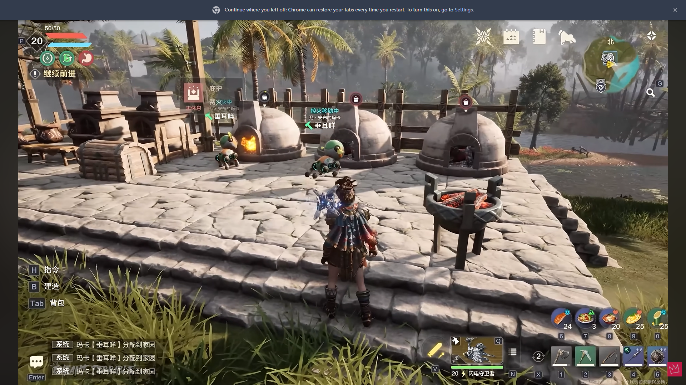

# 机械兽生产线：从自动工作到清晰反馈

**Evan（Yaxin）Ge · C++ / Lua / UMG · ProjectZ 具体历史工作回顾**

机械兽可以自动采集、搬运、制造和维护家园。我的工作连接生产任务、行为表现和配套 UI，让玩家理解机械兽正在做什么、为什么中断，以及当前工作的具体对象。

[English](README.md) · [案例（英文）](docs/CASE_STUDIES.md) · [决策故事（英文）](docs/DECISIONS.md) · [配置工作流（英文）](docs/AUTHORING.md) · [真实接口导读（英文）](docs/CODE_TOUR.md) · [画面与英文图注](media/README.md)

## 我的工作范围

我开发、维护了生产任务与机械兽行为表现的接入，包括接收工作、移动与表演切换、目标变化、中断处理和搬运物件显示一致性，也参与配套 UI 的接入迭代与机械兽配置工作流。完整生产系统和共享头顶 UI 基础设施属于团队协作成果。

## 材料说明

这是历史工作回顾，不是新功能提案。主线以核对过的实际代码关系为准，保留关键接口名称与职责说明，省略实现函数体和工程资源。本页是唯一中文 README，其余说明以英文为主。

仓库原有的可移植模型是后来独立编写的参考材料，已移到[参考附录的阅读路线](docs/REFERENCE_APPENDIX.md)，不会改称原项目代码。模型测试不作为历史项目测试或实机性能结果。

## 1. 不把每个表现阶段都当成新任务

我维护的生产线组件先从机械兽当前数据构建任务描述，再集中处理任务切换。移动与工作表演可能属于同一个工作类型；搬运阶段也有接收提示的专门判断。工作中目的地变化时，走中止、更新目标、重新执行的路径。

实际接口包括 `OnPalStateChanged`、`ReceiveProductJob`、`FinishCurrentJob` 和 `OnDestinationChanged`。这里使用当前／上次任务和状态，不是参考模型中的“任务编号＋版本号”。价值是让新增工种与问题定位有明确入口，不是宣称实现了通用生产调度器。

## 2. 状态与具体内容都必须一致

一个问题在于不能把阻塞原因简单丢失成闲置表现；另一个问题是新任务生效前刷新搬运物件，导致表现读取旧数据。我维护了状态映射与刷新顺序：先处理任务，再由 `RefreshAvatarAppearence` 比较新任务的物品 ID 与当前表现记录，必要时刷新搬运物件。

共享头顶 UI 的文字与气泡分别按配置选择状态。搬运状态不变时，物品也可能变化，所以气泡还要检查附属数据。这条检查实际存在于 Tick；变化后调用 `RefreshStyle`，包含样式与动画逻辑，不能写成彻底事件驱动或只更新图标的理想实现。

## 3. 配置通用关系，保留工种差异

**背景与判断。** 机械兽虽然工种、动作与表现不同，但约定了共同的行为准则，共用基类行为树工作流。对于已有工作类型，差异主要通过 Task 参数、工作 GA 和工种数据表达。我认为头顶 UI 应沿用这个共同约定，不必为每种机械兽另写一套界面逻辑。

**方案。** 对由能力驱动的提示，采用“行为树 Task 激活 GA → GA 的状态 Tag → 头顶 UI 状态映射”的关系。Task／状态决定采用哪种表现，工种与当前任务数据决定显示什么，UI 配置提供对应样式与动画。比如同为搬运，可以沿用物品气泡形式，但图标来自当前正在搬运的物品，而不是为木材与矿石各做一个 Widget。

**实现边界。** 更准确地说，这是间接选择表现，不是 Task 直接创建 Widget。原生头顶父控件已经绑定文字与气泡子控件，气泡按 `ShowType` 切换既有表现，再填入具体数据。用于选择 GA 的 `AbilityTagContainer` 与能力激活期间持有的 `ActivationOwnedTags` 也不是同一概念；项目提供按配置同步后者到客户端的机制。

现有框架不只有 GA Tag 一条输入：还包含 AI 状态、中断原因，以及 `BTT_PalPlayEmote` 经生产线组件直接更新表情 Tag 的路径。文字与气泡各有优先级配置，数值较小者优先，具体内容还需要处理同状态下的数据变化。

**贡献与取舍。** 我在接入、配置和迭代中采用了“通用行为约定＋状态选择表现＋数据填充内容”的划分，复用团队共享框架。新增既有工种的变化尽量留在参数、GA 与内容层；如果出现真正新的生命周期，仍需要明确扩展。代价是必须维护行为、Tag、UI 映射与优先级的一致性，不能只检查动作能否播放。

关键词：shared behaviour contract · task-driven ability activation · status-tag mapping · presentation mode versus payload · data-driven feedback。[完整英文叙述](docs/DECISIONS.md)。

原编辑器截图已无法取得，因此只说明核实的配置字段与实际工作流，不伪造工具截图，也不把独立验证器写成项目原有的一键生成工具。

## 定位问题的方法

我添加、迭代过生产线诊断，把同一机械兽的分配目标、黑板／移动／传送目标、新旧 AI 状态和控制器信息放在一起观察。先找到数据在哪一层开始不一致，再决定修改调度接入、行为还是表现。

头顶 UI 还有定向状态检查入口，用于观察状态组合。这与追踪真实生产执行互相补充，但不能把“有调试信息”直接等同于“修复已验证”。

## 画面与验证

截图来自 [ENFANT TERRIBLE 的公开 YouTube 视频](https://www.youtube.com/watch?v=QLgoOZu9biw)。四张独立静帧展示生产编队、工作阶段、设施暂停和搬运物品气泡；保留原图及水印，不宣称连续操作或修复前后对照。

独立参考材料包含 45 项 C++ 检查、25 项 Lua 检查和模拟流程。没有把这些结果描述为原游戏、完整 Unreal 集成或实机性能测试。[验证边界（英文）](docs/TESTING.md)。

[建造与物件交互](https://github.com/seak123/building-ui-portfolio) · [组队、匹配与支援](https://github.com/seak123/multiplayer-ui-portfolio)
