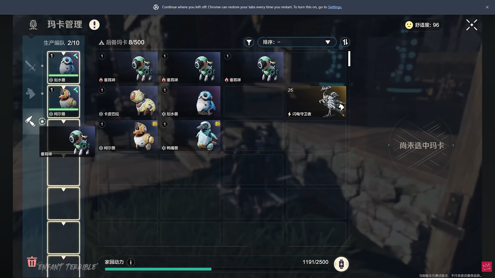
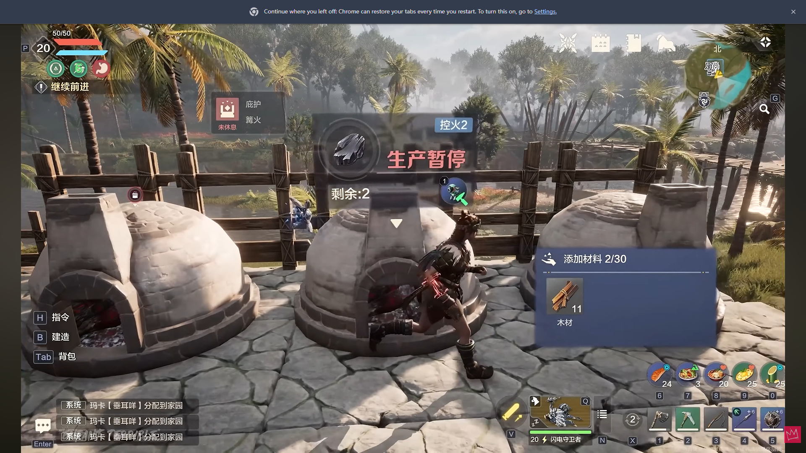
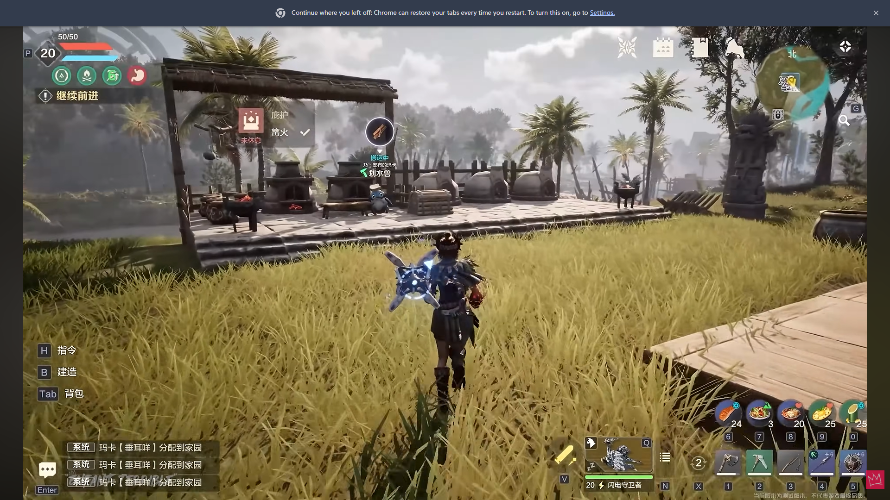

# In-game UI gallery / 实际游戏界面

[Overview](../README.md) · [Engineering stories](../docs/CASE_STUDIES.md) · [Authoring workflow](../docs/AUTHORING.md)

Four stills from [ENFANT TERRIBLE's public YouTube gameplay video](https://www.youtube.com/watch?v=QLgoOZu9biw), supplied for this case study by Evan Ge. The recording is by the video creator, not Evan. Creator watermarks and the supplied images are preserved unchanged. Exact timestamps are not available.

四张截图均来自上述 ENFANT TERRIBLE 公开视频，由 Evan 为本案例提供。录像并非 Evan 录制，原图与创作者水印完整保留，暂无精确时间点。

Each figure is an independently labelled visual state, not a claimed chronological sequence. English UI translations below are descriptive, not official localisation. These images illustrate the feature; they do not by themselves prove implementation details or a before/after bug fix.

各图分别说明可见状态，不宣称组成连续操作过程。英文翻译为说明性翻译，并非官方本地化文本；截图展示功能形态，不能单独证明实现细节或修复前后的差异。

## 1. Production roster / 生产编队

> The management screen brings together the active production team, reserve creatures and home energy, giving the player context for assigning workers.

**What to notice:** the left column shows the production roster and its capacity (2/10); the centre shows reserve creatures (8/500). The home-energy readout is visible along the bottom. The unselected details area and the creature card over the roster show a selection/assignment context, but this still does not demonstrate a completed drag-and-drop operation.

**Key labels:** 生产编队 — Production team; 后备玛卡 — Reserve creatures; 家园动力 — Home energy; 尚未选中玛卡 — No creature selected.

左侧生产编队、中间后备列表、底部家园动力共同构成分配工作的操作背景。此图不用于证明完整拖拽流程，也不把动力读数当作后台校验逻辑的证据。

**Engineering connection:** [management UI and authoritative requests](../docs/ARCHITECTURE.md#intent-is-not-authority--操作意图不同于权威结果). The reference panel separates player feedback from the service's assignment decision.

## 2. Work phases in the world / 世界中的工作阶段

> World-space labels distinguish a worker tending a furnace from one moving to fire-tending work, keeping the current work phase visible beside the creature.

**What to notice:** workers near the furnaces have different activity labels. The player can read those labels in the world without opening the management panel. The creature text and the separate markers above the facilities are different UI elements.

**Key labels:** 控火中 — Tending fire; 控火移动中 — Moving to fire-tending work.

头顶文字直接说明机械兽所处的工作阶段。机械兽自身的状态文字与炉子上方的设施标记需要区分，不能把画面里所有世界空间 UI 都当作同一控件。

**Engineering connection:** [one assignment, many phases](../docs/CASE_STUDIES.md#one-assignment-many-phases). The image illustrates distinct phases; the code/story explains how they are coordinated.

## 3. Facility production state / 设施生产状态

> The facility overlay combines a paused production state, a remaining count, worker context and material information at the workstation.

**What to notice:** the large red message makes the paused state prominent. A worker portrait and the nearby material panel provide related context. The picture alone does not establish why production is paused, so it is not presented as evidence of the energy-related bug described elsewhere.

**Key labels:** 生产暂停 — Production paused; 剩余：2 — Remaining: 2; 添加材料 — Add materials; 木材 — Wood.

这张图补充设施侧的生产反馈：暂停状态、剩余数量、机械兽信息和材料面板放在同一场景中。它不说明暂停根因，也不被当作“缺能量 bug”的实录。

**Engineering connection:** [state and payload consistency](../docs/CASE_STUDIES.md#state-and-payload-consistency). Worker state and facility progress are related views, not interchangeable sources of truth.

## 4. Item-specific transport bubble / 搬运物品气泡

> An item-specific overhead bubble identifies wood while the worker's status reads Transporting, making the current work payload visible in the world.

**What to notice:** the bubble communicates which item is involved, while the text communicates the activity. A generic work icon would lose this distinction. This still shows one payload; it does not demonstrate switching items or synchronisation correctness over time.

**Key label:** 搬运中 — Transporting.

图标回答“搬的是什么”，文字回答“正在做什么”。这正是工作状态与具体物品数据需要分开处理的原因。单张截图没有证明物品切换过程或持续同步的正确性。

**Engineering connection:** [same-state payload refresh](../docs/ARCHITECTURE.md#state-and-payload-both-matter--状态与内容都要比较) and the carry-visual ordering story.

## Authoring and diagnostics / 配置与调试

Original editor captures are unavailable. The [authoring journey](../docs/AUTHORING.md) explains Actor Blueprint setup, work abilities and head-status configuration without substituting a fabricated editor screenshot. The [configuration example](../Content/WorkerProfiles/gatherer.lua), [validator](../Content/Lua/AuthoringProfile.lua) and [synthetic debug trace](../examples/work_trace.cpp) are clearly labelled reference material.

原编辑器截图已无法取得。配置部分继续使用流程说明、明确标注的参考配置和代码，不制作仿冒原工具的截图。实际游戏画面和独立演示材料保持区分。
